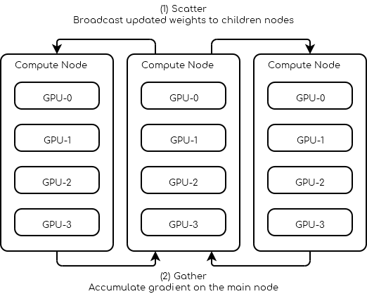

Nós Múltiplos
=============

Paralelismo de Dados
--------------------

Solicite 3 nós com pelo menos 4 GPUs cada um.

.. code-block:: console

    #!/bin/bash

    # Number of Nodes
    #SBATCH --nodes=3

    # Number of tasks. 3 (1 per node)
    #SBATCH --ntasks=3

    # Number of GPU per node
    #SBATCH --gres=gpu:4
    #SBATCH --gpus-per-node=4

    # 16 CPUs per node
    #SBATCH --cpus-per-gpu=4

    # 16Go per nodes (4Go per GPU)
    #SBATCH --mem=16G

    # we need all nodes to be ready at the same time
    #SBATCH --wait-all-nodes=1

    # Total resources:
    #   CPU: 16 * 3 = 48
    #   RAM: 16 * 3 = 48 Go
    #   GPU:  4 * 3 = 12

    # Setup our rendez-vous point
    RDV_ADDR=$(hostname)
    WORLD_SIZE=$SLURM_JOB_NUM_NODES
    # -----

    srun -l torchrun \
        --nproc_per_node=$SLURM_GPUS_PER_NODE\
        --nnodes=$WORLD_SIZE\
        --rdzv_id=$SLURM_JOB_ID\
        --rdzv_backend=c10d\
        --rdzv_endpoint=$RDV_ADDR\
        training_script.py

Você pode encontrar abaixo um esboço de um script do PyTorch sobre como um treinador multi-nó pode ser elaborado.

.. code-block:: python
    :name: Training script outline for multi node training

    import os
    import torch.distributed as dist

    class Trainer:
        def __init__(self):
            self.local_rank = None
            self.chk_path = ...
            self.model = ...

        @property
        def device_id(self):
            return self.local_rank

        def load_checkpoint(self, path):
            self.chk_path = path
            # ...

        def should_checkpoint(self):
            # Note: only one worker saves its weights
            return self.global_rank == 0 and self.local_rank == 0

        def save_checkpoint(self):
            if self.chk_path is None:
                return

            # Save your states here
            # Note: you should save the weights of self.model not ddp_model
            # ...

        def initialize(self):
            self.global_rank = int(os.environ.get("RANK", -1))
            self.local_rank = int(os.environ.get("LOCAL_RANK", -1))

            assert self.global_rank >= 0, 'Global rank should be set (Only Rank 0 can save checkpoints)'
            assert self.local_rank >= 0, 'Local rank should be set'

            dist.init_process_group(backend="gloo|nccl")

        def sync_weights(self, resuming=False):
            if resuming:
                # in the case of resuming all workers need to load the same checkpoint
                self.load_checkpoint()

                # Wait for everybody to finish loading the checkpoint
                dist.barrier()
                return

            # Make sure all workers have the same initial weights
            # This makes the leader save his weights
            if self.should_checkpoint():
                self.save_checkpoint()

            # All workers wait for the leader to finish
            dist.barrier()

            # All followers load the leader's weights
            if not self.should_checkpoint():
                self.load_checkpoint()

            # Leader waits for the follower to load the weights
            dist.barrier()

        def dataloader(self, dataset, batch_size):
            train_sampler = ElasticDistributedSampler(dataset)
            train_loader = DataLoader(
                dataset,
                batch_size=batch_size,
                num_workers=4,
                pin_memory=True,
                sampler=train_sampler,
            )
            return train_loader

        def train_step(self):
            # Your batch processing step here
            # ...
            pass

        def train(self, dataset, batch_size):
            self.sync_weights()

            ddp_model = torch.nn.parallel.DistributedDataParallel(
                self.model,
                device_ids=[self.device_id],
                output_device=self.device_id
            )

            loader = self.dataloader(dataset, batch_size)

            for epoch in range(100):
                for batch in iter(loader):
                    self.train_step(batch)

                    if self.should_checkpoint():
                        self.save_checkpoint()

    def main():
        trainer = Trainer()
        trainer.load_checkpoint(path)
        tainer.initialize()

        trainer.train(dataset, batch_size)

.. note::
    
    "Para contornar o GIL (Bloqueio Global do Interpretador) do Python,
    o PyTorch cria um processo para cada GPU. No exemplo acima, isso 
    significa que pelo menos 12 processos são criados, pelo menos 4 em cada nó."