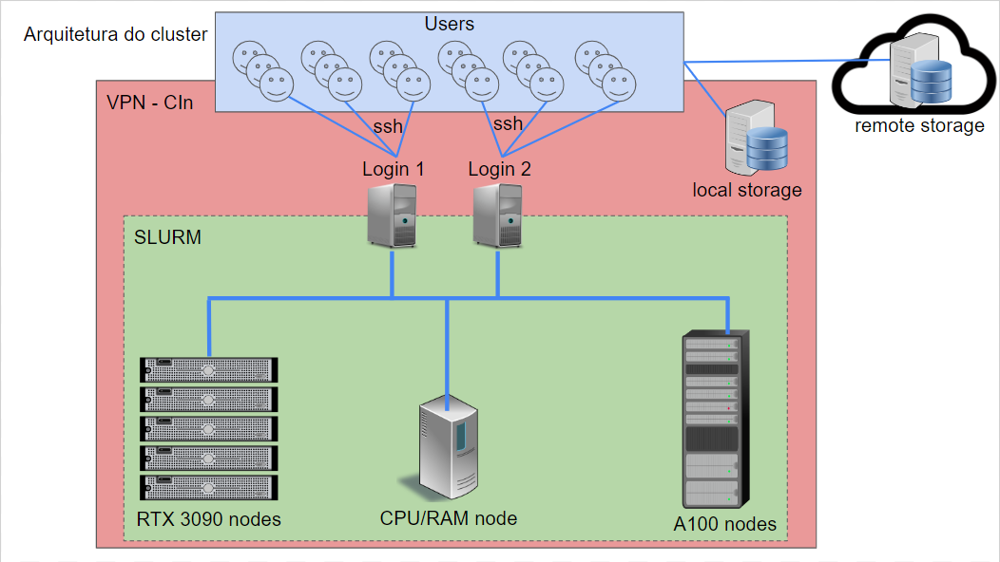

Arquitetura do cluster Apuana
=============================

Visão geral da arquitetura e acesso
-----------------------------------

Visão geral de funcionamento do cluster
---------------------------------------
.. image:: cluster_overview2.png    
- Login Nodes
    slurm-client[1-2]
    slurm (srun, salloc, sbatch)
- Management
    slurm-manager[1-2]
    slurmctld
    slurmdbdb
- Compute Nodes
    cluster-node[1-5]
    slurmd
- Storage:
    $SLURM_TMPDIR
- Parallel Storage
    slurmdbdb database
-   Storage (baseado no MILA)

    $HOME

    $DATASETS

    $SCRATCH

    $PROJECTS

    $ARCHIVE

Política de Alocação de Recursos
================================

- Cota destinada aos pesquisadores (geralmente professores do CIn)
    - Pesquisadores definem os membros do grupo de pesquisa
    - Todos em um grupo de pesquisa usam a cota do pesquisador
- A cota destinada para cada pesquisador depende da quantidade de recursos que ele investiu no cluster
- Uma cota mínima será fornecida a todos os professores do CIn e aos pesquisadores participantes do Projeto Hiper.

Política de Uso
===============

- Fila de jobs:
    - Cada usuário submete um job ao SLURM
    - Na submissão do job, o usuário especifica os recursos que precisa (GPUs, CPUs, RAM)
    - Quanto mais recursos ele solicitar, menor a prioridade
    - Usuários com mais cota possuem maior prioridade

- Categorias de tempo execução:
    - Jobs de longa duração (ex.: 7 dias sem ser finalizadoe e usando poucos recursos)
    - Jobs de média duração (ex.: 1 dia sem ser finalizado e usando uma quantidade média de recursos)
    - Jobs de curta duração (ex.: 2 horas sem sofrer interrupção usando maior quantidade de recursos)

- Preempção:
    - Após um certo tempo mínimo de execução, um job pode sofrer interrupção para dar espaço a outros jobs (em situações de sobrecarga)
    - Ao sofrer interrupção, o job volta para a fila de espera e será retomado quando houver recursos para ele
    - O usuário é responsável por implementar o salvamento e carregamento do estado do seu job (checkpointing)

Pontos Importantes Sobre a Segurança
====================================

- Acesso externo indevido
- Privacidade de dados
    - Datasets públicos (preferencialmente compartilhados)
    - Datasets privados (compartilhados entre os membros de um grupo de pesquisa)
- Uso indevido de recursos
    - Computação/armazenamento fora da cota de uso
    - Mineração de criptomoedas (dentro ou fora da cota)

